Analysis of RNAseq data
========================================================
author:MRC LMS Bioinformatics Core
date: 30 November 2017
width: 1440
height: 1100
autosize: true
font-import: <link href='http://fonts.googleapis.com/css?family=Slabo+27px' rel='stylesheet' type='text/css'>
font-family: 'Slabo 27px', serif;
css:style.css


RNA-seq Introduction 
========================================================

RNA Sequencing (**RNA-seq**) is a well established technique which allows for studying expression profiles of thousands of genes/transcripts simultaneously. 

<div align="center">
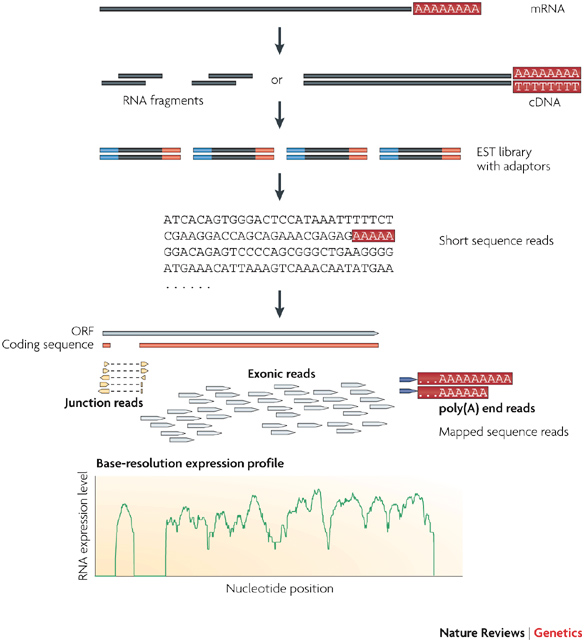
</div>

* Nature Reviews Genetics 10, 57-63 (January 2009)


RNA-seq analysis pipeline
====================================

<div align="center">
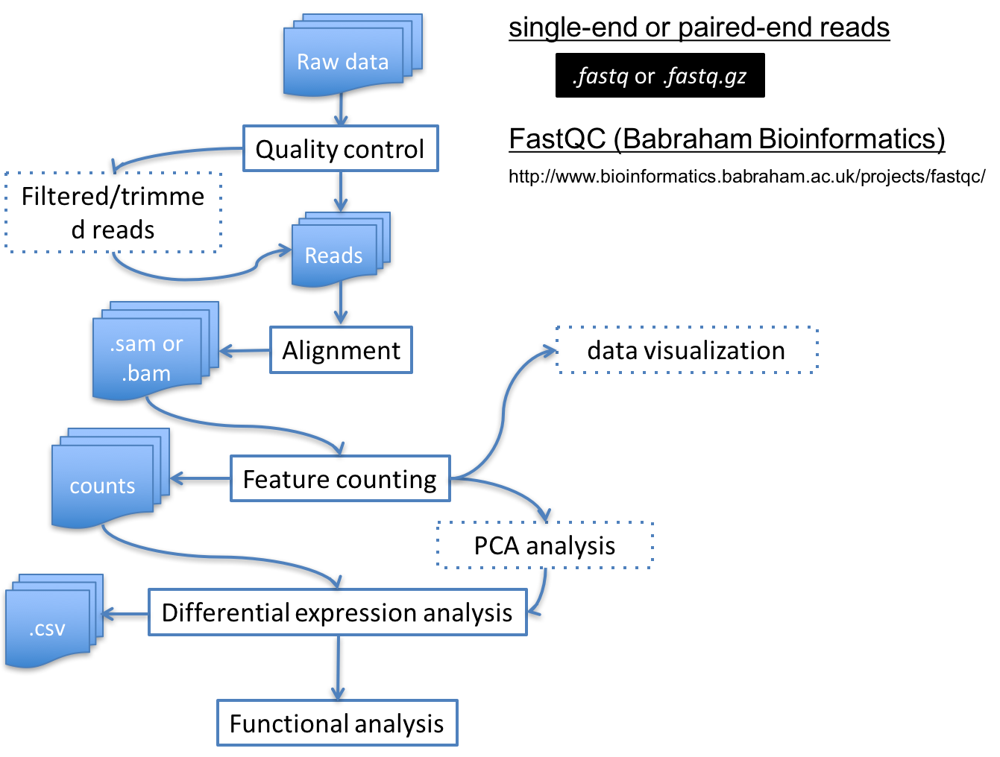
</div>


Contents
====================================
* [Quality Assessment](#/quality).
* [Read alignment](#/alignment).
* [Read counting](#/counting).
* [Differential gene expression analysis](#/de).
* [Exploring and saving results](#/explore).


Quality Assessment - FastQC (1/2)
====================================
id: quality

<div align="center">
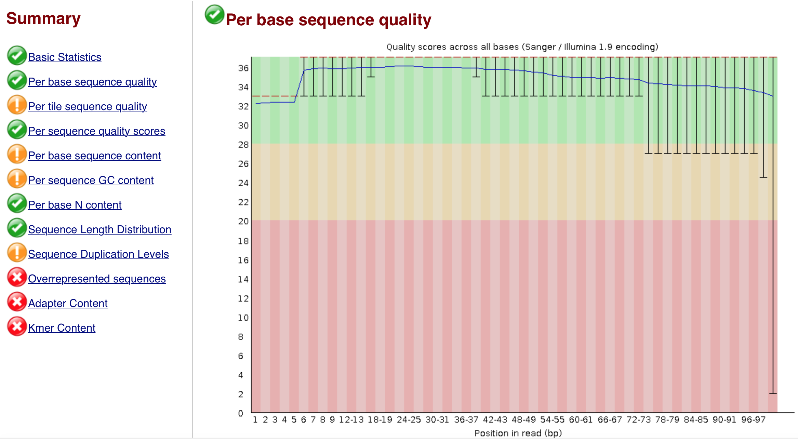
</div>


Quality Assessment - FastQC (2/2)
====================================

<div align="center">
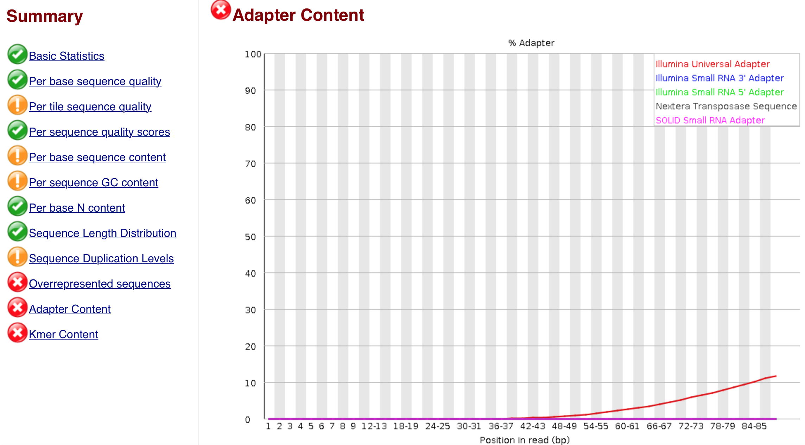
</div>


Read alignment - gapped aligner (1/2)
====================================
id: alignment

First step in RNA-Seq data analysis is to align the raw reads to genome/transcriptome. 

For RNASeq data alignment, aligner need to be able to align across the exon-exon junction.

<div align="center">
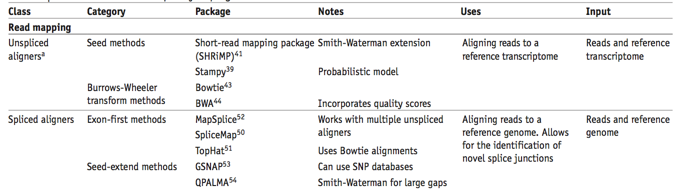
</div>

* Garber et al., 2011. Nat Methods. 8(6):469-77. Table 1


Read alignment - gapped aligner (2/2)
====================================

<div align="center">
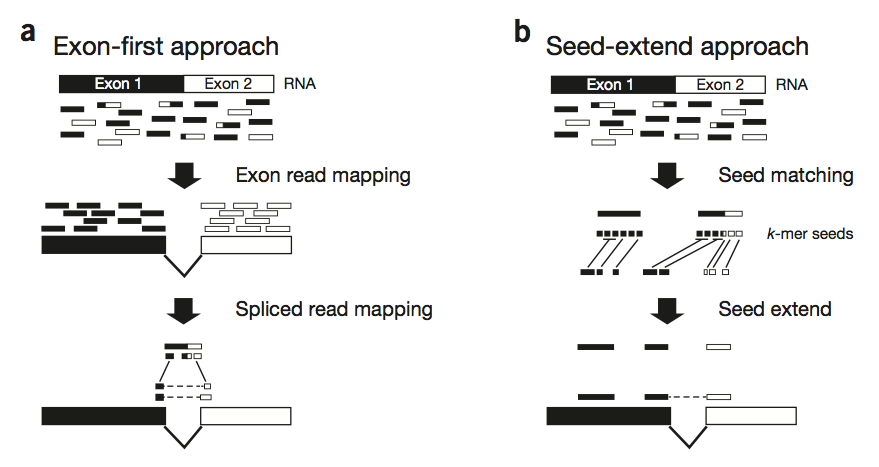
</div>

* Garber et al., 2011. Nat Methods. 8(6):469-77. Figure 1


Check before you carry on ...
========================================================

* What genome is involved?
   - Is it a well annotated organism or a poorly annotated one?
   - A different analysis strategy depending on the genome?

* Single end or Paired end sequencing experiment?

* Strand specific or non stand specific
  - Useful to distinguish sense and antisense transcripts  


unstranded RNAseq
========================================================

<div align="center">
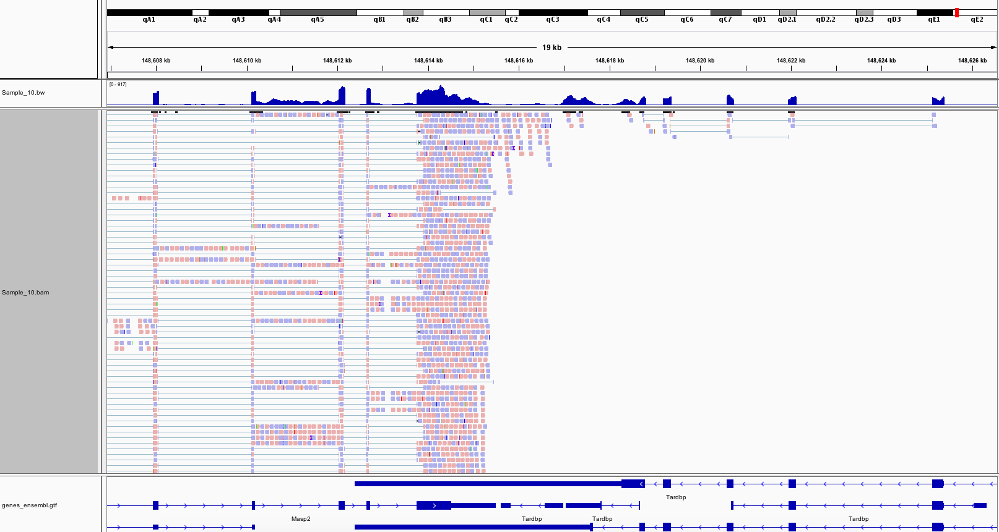
</div>

Masp2 (sense) and Tardbp (antisense)

fr-firststrand RNAseq
========================================================

<div align="center">
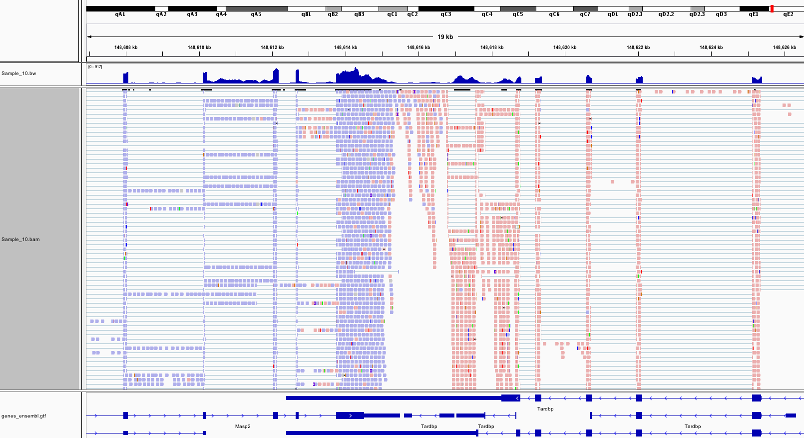
</div>

Masp2 (sense) and Tardbp (antisense)

========================================================

<div align="center">
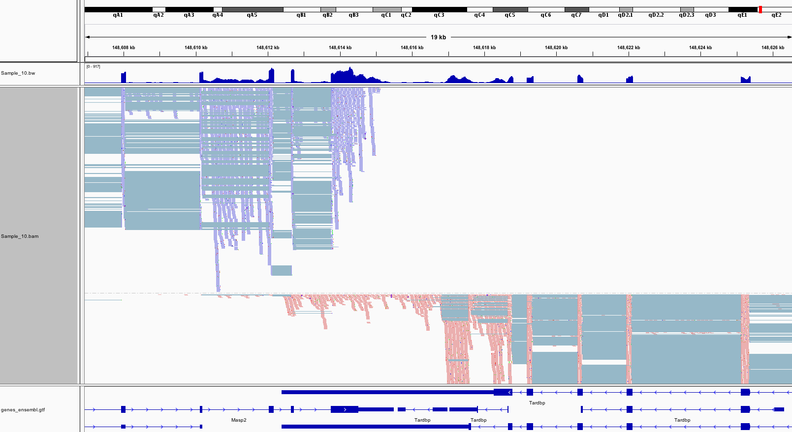
</div>

Masp2 (sense) and Tardbp (antisense)


Read Counting (1/2)
====================================
id: counting

After alignment, next step is to assign reads to features such as genes, transcripts
or exons.

* htseq-count

	Anders et al., 2014. Bioinformatics. 31(2):166-9
	
* featurecount function in Rsubread R package

	Liao et al., 2014. Bioinformatics. 30(7):923-30


Read Counting (2/2)
====================================

<div align="center">
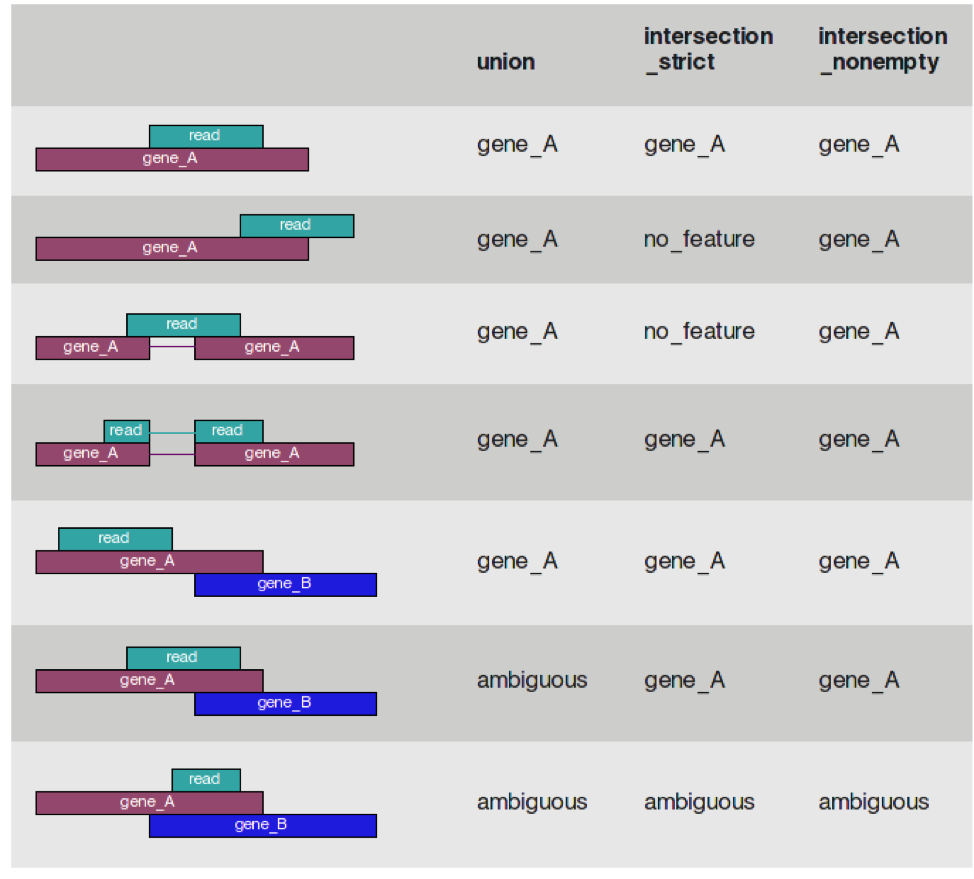
</div>
	
http://htseq.readthedocs.io/en/master/count.html


Check before you carry on again ...
========================================================

* How many factors involved in experiment (genotype, treatment, time course etc.)

   - Single factor vs multi factor analysis? 
   
   - Interactions?
   
* In this session, we will only discuss the single factor analysis
   
   

RNA-seq analysis pipeline
====================================

<div align="center">

</div>


Set working directory
========================================================

Before running any of the code, we need to set the working directory to the folder we unarchived. 
You may navigate to the unarchived RNAseq_short_ZENCODE/course folder in the Rstudio menu

**Session -> Set Working Directory -> Choose Directory**

or in the console, 

Use the getwd() to see where your current directory is


```r
getwd()
```

Use setwd() to set up your directory in the console


```r
setwd("/PathToMyDownload/RNAseq_short_ZENCODE/course")
```


Material
====================================

Dataset
* [GSE68360] (http://www.ncbi.nlm.nih.gov/geo/query/acc.cgi?acc=GSE68360)

We have generated the following files for this session.

- **target** file that contain the sample information.

targets.txt

- **count** matrix  containing count table

AllCounts.csv


Read sample information
========================================================
id: de

Read in **targets.txt** file by using read.table function


```r
targets <- read.table("targets.txt",sep="\t",header=TRUE)  

targets
```

```
  Sample Group Batch        InputFile       InputFile2 OutputFile
1   Viv1   Viv     a SRR2001243.fastq SRR2001244.fastq   Viv1.bam
2   Viv2   Viv     b SRR2001245.fastq SRR2001246.fastq   Viv2.bam
3   Viv3   Viv     c SRR2001247.fastq SRR2001248.fastq   Viv3.bam
4   Hfd1   Hfd     a SRR2001249.fastq SRR2001250.fastq   Hfd1.bam
5   Hfd2   Hfd     b SRR2001251.fastq SRR2001252.fastq   Hfd2.bam
6   Hfd3   Hfd     c SRR2001253.fastq SRR2001254.fastq   Hfd3.bam
```

Read count data
========================================================

Load count data by using read.csv function


```r
AllCounts<-read.csv(file="AllCounts.csv",row.names = 1)
```

 Show first few rows of "AllCounts" object and the class of AllCounts object


```r
head(AllCounts)
```

```
                   Viv1 Viv2 Viv3 Hfd1 Hfd2 Hfd3
ENSMUSG00000090025    0    0    0    0    0    0
ENSMUSG00000064842    0    0    0    0    0    0
ENSMUSG00000051951    0    1    1    3    0    0
ENSMUSG00000089699    0    0    0    0    0    0
ENSMUSG00000088390    0    0    0    0    0    0
ENSMUSG00000089420    0    0    0    0    0    0
```

```r
class(AllCounts)
```

```
[1] "data.frame"
```


Prepare deseqdataset object 
========================================================

 Collect sample information


```r
cData<-data.frame(name=targets$Sample,                                                                          Group=targets$Group,Batch=targets$Batch)

rownames(cData)<-cData[,1]
```


Prepare deseqdataset object (Continued)
========================================================

 Construct deseqdataset object

The class used by the DESeq2 package to store the read counts is **DESeqDataSet**.


```r
 library(DESeq2)

dds<-DESeqDataSetFromMatrix(
    countData= AllCounts,colData=cData,
    design=~Group)
```

Differential expression analysis
========================================================

The standard differential expression analysis steps are wrapped into a single function, **DESeq**,
which performs normalization, fitting to the model and statistical testing.


```r
dds<-DESeq(dds)

?DESeq
```

The function DESeq runs the following functions in order,

**estimateSizeFactors()**

**estimateDispersions()**

**nbinomWaldTest()**


DESeq function - estimateSizeFactors()
========================================================


1 - **Estimation of size factors**

The sizeFactors vector assigns to each column of the count matrix a value, the size factor, such that  count  values  in  the  columns  can  be  brought  to  a  common  scale  by  dividing  by  the  corresponding size factor.


```r
#  estimateSizeFactors()

sizeFactors(dds)
```

```
     Viv1      Viv2      Viv3      Hfd1      Hfd2      Hfd3 
1.2430187 0.7755226 1.0501449 0.9457439 1.0124687 1.0515602 
```

Calculating  sizeFactors
========================================================

<div align="center">

</div>

DESeq2 calculation of the sizeFactors 
========================================================

Please refer to Equation (5):

**Anders S and Huber W. (2010). Differential expression analysis for sequence count data. *Genome Biol.*:11(10):R106.**

$$
\hat{s_{j}}=\begin{matrix}
  median \\
  i
 \end{matrix}\frac{k_{ij}}{(\prod_{v=1}^{m}k_{iv})^{1/m}}
 
 \\
 \hat{s_{j}}:\text{estimated size factor for the jth sample}
 \\
 
$$
The denominator of this expression can be interpreted as a pseudo-reference sample obtained by taking the geometric mean across samples. Thus, each estimated size factor is computed as the median of the ratios of the j-th sample's counts to those of the pseudo-reference.


DESeq function - estimateDispersions()
========================================================

2 - **Estimation of dispersion**

This function obtains gene-wide dispersion estimates. Then, a curve is fit to the estimates to capture the overall trend of dispersion-mean dependence. 


```r
#  estimateDispersions()

head(dispersions(dds))
```

```
[1]       NA       NA 2.471224       NA       NA       NA
```

```r
plotDispEsts(dds)
```


DESeq function - nbinomWaldTest()
========================================================
3- **Hypothesis test for differential expression**


For significance testing, DESeq2 by default uses a Wald test, where
the function tests whether each model coefficient differs significantly from zero, using previously calculated sizeFactors and dispersion estimates.

The Wald test P values  are adjusted for multiple testing using the procedure of Benjamini and Hochberg.


```r
nbinomWaldTest()
```


Getting results
========================================================

Results tables are generated using the function **results()**, which extracts a results table with log2 fold changes, p  values and adjusted p values.

 Use the function "results()"


```r
res<-results(dds) 
```

 Order results by adjusted p value


```r
resOrdered<-res[order(res$padj),]

?results      
```


Getting results
========================================================


```r
head(resOrdered)
```

```
log2 fold change (MAP): Group Viv vs Hfd 
Wald test p-value: Group Viv vs Hfd 
DataFrame with 6 rows and 6 columns
                     baseMean log2FoldChange     lfcSE      stat
                    <numeric>      <numeric> <numeric> <numeric>
ENSMUSG00000024526   465.8790      -5.863471 0.2482237 -23.62172
ENSMUSG00000032080 14291.8178      -4.528817 0.2277876 -19.88176
ENSMUSG00000026475  3141.2571      -4.420009 0.2531844 -17.45767
ENSMUSG00000069170   343.9283      -3.645414 0.2240519 -16.27040
ENSMUSG00000042041   651.0023      -2.971362 0.1892775 -15.69844
ENSMUSG00000034634   199.3508      -4.344026 0.2806835 -15.47660
                          pvalue          padj
                       <numeric>     <numeric>
ENSMUSG00000024526 2.305664e-123 3.941302e-119
ENSMUSG00000032080  5.854814e-88  5.004109e-84
ENSMUSG00000026475  3.009769e-68  1.714966e-64
ENSMUSG00000069170  1.601048e-59  6.842080e-56
ENSMUSG00000042041  1.550018e-55  5.299202e-52
ENSMUSG00000034634  4.991579e-54  1.422101e-50
```

Add Gene symbol
========================================================


```r
# Add Gene Symbols

library(biomaRt)

mart=useMart('ENSEMBL_MART_ENSEMBL',
dataset='mmusculus_gene_ensembl',
host="may2012.archive.ensembl.org")

bm<-getBM(attributes=c('ensembl_gene_id','mgi_symbol'),
filters ='ensembl_gene_id',
values=rownames(resOrdered), mart=mart)

# see the first few rows of "bm" object
head(bm)      
```

```
     ensembl_gene_id    mgi_symbol
1 ENSMUSG00000073519       Gm10524
2 ENSMUSG00000085190 4930445N18Rik
3 ENSMUSG00000085190 3010027C24Rik
4 ENSMUSG00000091488        Gm6225
5 ENSMUSG00000090484       Gm17417
6 ENSMUSG00000073646       Gm10556
```

Add Gene symbol (Continued)
========================================================


```r
# merge the Gene_symbol to our DE dataset
resAnnotated <- merge(as.data.frame(resOrdered),bm,by.x=0,by.y=1)
head(resAnnotated)
```

```
           Row.names     baseMean log2FoldChange     lfcSE        stat
1 ENSMUSG00000000001 2.438865e+03   -0.009915849 0.1088892 -0.09106364
2 ENSMUSG00000000003 0.000000e+00             NA        NA          NA
3 ENSMUSG00000000028 3.803191e+01   -0.218532198 0.3005797 -0.72703575
4 ENSMUSG00000000031 1.419411e+01   -1.661493799 0.3665356 -4.53296731
5 ENSMUSG00000000037 4.993369e-01   -0.197619794 0.1948394 -1.01427038
6 ENSMUSG00000000049 3.907640e+04    0.107573651 0.1350213  0.79671637
        pvalue         padj mgi_symbol
1 9.274420e-01 0.9768743543      Gnai3
2           NA           NA       Pbsn
3 4.672041e-01 0.7750466744      Cdc45
4 5.816082e-06 0.0001606141        H19
5 3.104538e-01           NA      Scml2
6 4.256158e-01 0.7465829395       Apoh
```

```r
# change the column name
colnames(resAnnotated)[1]<-"ensembl_gene_id"
```

Add Gene symbol (Continued)
========================================================


```r
# Order results by adjusted p value
resAnnotated<-resAnnotated[order(resAnnotated$pvalue,decreasing=F),]

# show the result with gene symbol annotation
head(resAnnotated)
```

```
         ensembl_gene_id   baseMean log2FoldChange     lfcSE      stat
4582  ENSMUSG00000024526   465.8790      -5.863471 0.2482237 -23.62172
8820  ENSMUSG00000032080 14291.8178      -4.528817 0.2277876 -19.88176
5617  ENSMUSG00000026475  3141.2571      -4.420009 0.2531844 -17.45767
20354 ENSMUSG00000069170   343.9283      -3.645414 0.2240519 -16.27040
12526 ENSMUSG00000042041   651.0023      -2.971362 0.1892775 -15.69844
9814  ENSMUSG00000034634   199.3508      -4.344026 0.2806835 -15.47660
             pvalue          padj    mgi_symbol
4582  2.305664e-123 3.941302e-119         Cidea
8820   5.854814e-88  5.004109e-84         Apoa4
5617   3.009769e-68  1.714966e-64         Rgs16
20354  1.601048e-59  6.842080e-56         Gpr98
12526  1.550018e-55  5.299202e-52 2010003K11Rik
9814   4.991579e-54  1.422101e-50          Ly6d
```

Saving DEseq2 results
========================================================

Save the result in ".txt" or ".csv" format


```r
write.table(resAnnotated,file="DESeq_result.txt",sep="\t")
write.csv(resAnnotated,file="DESeq_result.csv",  row.names=F)
```


Exploring results
========================================================

We can summarize some basic tallies using the summary function.


```r
summary(res)
```

```

out of 22605 with nonzero total read count
adjusted p-value < 0.1
LFC > 0 (up)     : 989, 4.4% 
LFC < 0 (down)   : 1467, 6.5% 
outliers [1]     : 18, 0.08% 
low counts [2]   : 5493, 24% 
(mean count < 3)
[1] see 'cooksCutoff' argument of ?results
[2] see 'independentFiltering' argument of ?results
```

```r
# How many adjusted p-values were less than 0.05?
sum(res$padj < 0.05, na.rm=TRUE)
```

```
[1] 1970
```


MA plot
========================================================

The  function **plotMA()** shows  the  log2  fold  changes  attributable  to  a  given  variable  over  the  mean of normalized counts.  Points will be colored red if the adjusted p value is less than 0.1.  Points which fall out of the window are plotted as open triangles pointing either up or down.


```r
plotMA(res, main="DESeq2", ylim=c(-4,4))
```


After calling plotMA, we can use the function identify to interactively detect the row number of individual
genes by clicking on the plot. 
Recover the gene identifiers by saving the resulting indices:


```r
idx <- identify(res$baseMean, res$log2FoldChange)
rownames(res)[idx]
```


Plot counts
========================================================
 **Plot of normalized counts for a single gene on log scale**


```r
plotCounts(dds,gene=which.min(res$padj),intgroup="Group")
```


Coffee break and Exercise
=========================================================

11:30-11:45

* [RNAseq Exercises](http://mrccsc.github.io/RNAseq_short/course/Exercise_BasicDifferentialAnalysis.html)

Solutions
=========================================================

* [RNAseq Solutions](http://mrccsc.github.io/RNAseq_short/course/Answers_BasicDifferentialAnalysis.html)


Transformation of count data
========================================================
id: explore

In order to test for differential expression, we operate on raw counts. However for other downstream analyses ( e.g. visualization or clustering) it is useful to work with transformed versions of the count data.

Aim of these transformations,is  to  remove  the  dependence  of  the  variance on  the  mean, particularly  the  high  variance  of  the  logarithm  of  count  data  when  the  mean  is  low. 

    y = log2(n + n0)
            
    n represents the count values and n0 is a positive constant.
    
 There are two alternative approaches of choosing the parameter equivalent to n0 above.

**1. The regularized logarithm or rlog**

**2. variance stabilizing transformation or vst**


Both transforms the original count data to the log2 scale normalized to library size.


```r
rld<-rlog(dds)  

vsd <- varianceStabilizingTransformation(dds)
```

Transformation of count data
========================================================

<div align="left">

</div>
<div align="topright">

</div>


========================================================

<div align="center">

</div>


Data quality assessment 
========================================================

Data quality assessment and quality control  are essential steps
of any data analysis. These steps should typically be performed very early in the analysis of a new data set,
preceding or in parallel to the differential expression testing.

We will use following visualization tools to assess the data quality.

* Heatmap of count matrix

* Heatmap of sample to sample distances

* Principal component analysis plot


Heatmap of the count matrix
========================================================

To explore a counts matrix, it is often useful to look it as heatmap.


```r
library("pheatmap")
select <-order(rowMeans(counts(dds,normalized=TRUE)),decreasing=TRUE)[1:20]


pheatmap(assay(rld)[select,])
```


Heatmap of the count matrix
========================================================


```r
pheatmap(assay(vsd)[select,])
```


Heatmap of sample to sample distances
========================================================

Another use of the transformed data is sample clustering. Here, we apply the dist function to the transpose
of the transformed count matrix to get sample-to-sample distances. 

The assay function is used to extract the matrix of normalized values.


```r
rlogcount <- assay(rld)    
sampleDists <- as.matrix(dist(t(rlogcount)))
```

========================================================

 Save the plot as png file


```r
library(RColorBrewer)
showcols <- brewer.pal(8, "Set1")[1:length(unique(colData(dds)$Group))]

library(gplots)
png(file="sample_dis_map.png")
  heatmap.2(as.matrix(sampleDists), key=F, trace="none",
    col=colorpanel(100, "black", "white"),
    ColSideColors=showcols[colData(dds)$Group], 
    RowSideColors=showcols[colData(dds)$Group],
    margin=c(10, 10), main="Sample Distance Matrix")
dev.off()
```

```
quartz_off_screen 
                2 
```


=======================================================

<div align="center">
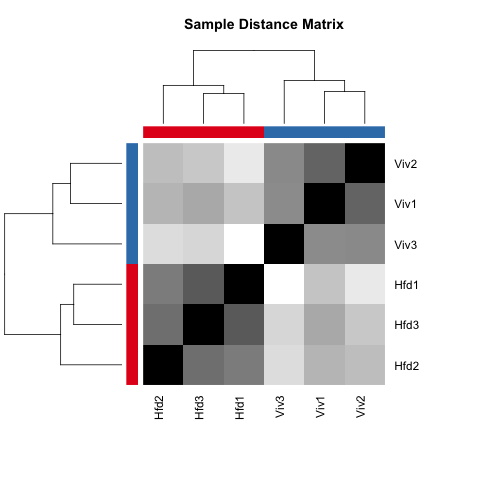
</div>


Principal component plot of the samples
========================================================

**PCA plot** is useful to spot individual sample outliers. 


```r
plotPCA(rld, intgroup="Group")
```


```r
# save the plot

library(ggplot2)
ggsave(file="PCA_plot_version1.png")
```


Exercises
=========================================================

* [RNAseq Exercises](http://mrccsc.github.io/RNAseq_short/course/Exercises_Visualization.html)

Solutions
=========================================================

* [RNAseq Solutions](http://mrccsc.github.io/RNAseq_short/course/Answers_Visualization.html)


Variations to standard workflow
========================================================


**Factor levels**

By default, R will choose a reference level for factors based on alphabetical order. 
The comparisons will be based on the alphabetical order of the levels. We can either explicitly tell results which comparison to make using the contrast argument (this will be shown later), or
we can explicitly set the factors levels.

**Setting the factor levels**

cData$Group <- factor(cData$Group, levels=c("Viv","Hfd"))

or using relevel, just specifying the reference level:


```r
cData$Group<-relevel(cData$Group,ref="Viv")
```


=========================================================

**Using Contrasts**

Contrasts enable the user to generate results for all  possible
comparisons: 

Consider an experimental design containing a factor with three levels, say A, B and C.
We can use contrasts to compare B vs A, of C vs A, and C vs B.


```r
    res_contrast<-results(dds,contrast=c("Group","Hfd","Viv")) 

    
    summary(res_contrast)
```

```

out of 22605 with nonzero total read count
adjusted p-value < 0.1
LFC > 0 (up)     : 1467, 6.5% 
LFC < 0 (down)   : 989, 4.4% 
outliers [1]     : 18, 0.08% 
low counts [2]   : 5493, 24% 
(mean count < 3)
[1] see 'cooksCutoff' argument of ?results
[2] see 'independentFiltering' argument of ?results
```


